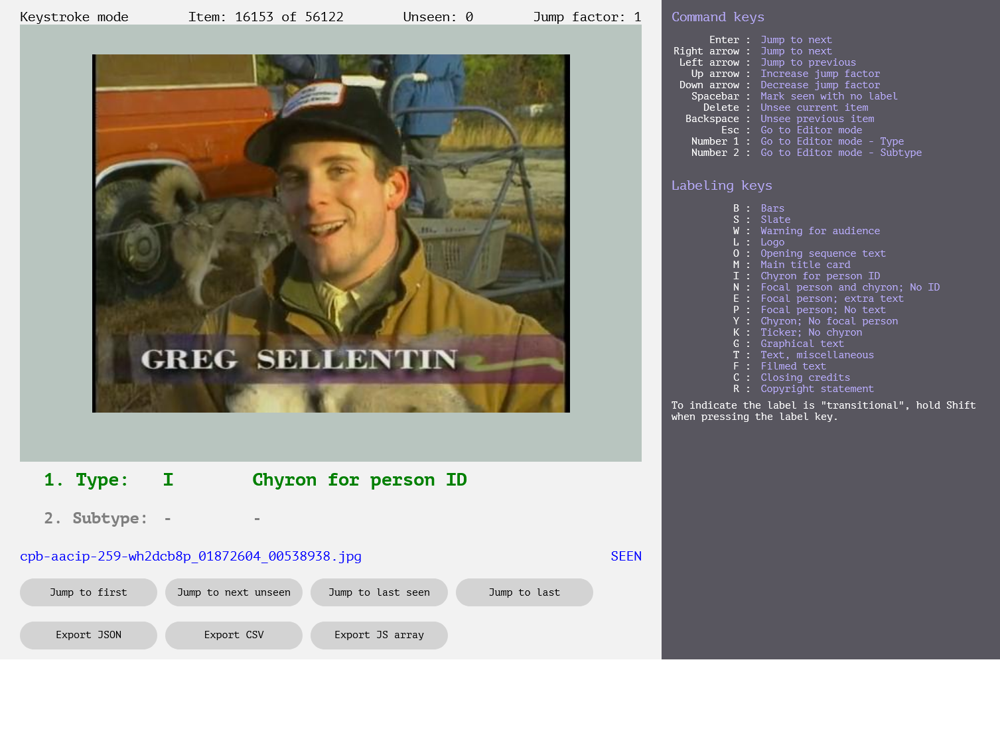

# Scene Recognition 

## Project Overview

> The essential goal for scene recognition is to assign the semantic labels to the given images, these semantic labels are defined by human beings including different natural views, indoor scenes, outdoor environments and etc.
> -- [Scene recognition: A comprehensive survey](https://www.sciencedirect.com/science/article/pii/S003132032030011X)

This project is an attempt at developing a dataset for a new CLAMS app that detects "frames of interest" or "scene recognition" in general as an update to the previous efforts of seeking different frames out separately. 
"Frames of Interest" tend to be frames from a video that contain information (primarily in some overlaying textual forms) on screen that is useful for archiving purposes. This can include slates, chyrons, credits, images of people or other visual objects. 

From the annotation side, the project is done by sampling videos at a certain rate (e.g., 1 frame every 2 seconds) to create a diverse set of frames as a collection of stills (going forward called "image sets"). 
The frames are then annotated for if they fit one of the interest categories or not. 

Conceptually, the annotation project simply annotates stills found at recurring intervals (but arbitrarily chosen) that do not themselves describe the start and end times of a _scene_. Additional post-processing by software can stitch together these still level annotations into time interval annotations, but manually annotating time intervals is not under scope of the project. 


### Specs

* Annotation Project Name - `scene-recognition`
* Annotator Demographics
    * Number of annotators - 2
    * Occupational description - College Student and Metadata Operation Specialist GBH
    * Age range - 20-40s
    * Education - Higher education
* Annotation Environment Information
    * Name - Keystroke Labeler
    * Version - unknown
    * Tool documentation - (see below tool installation)
* Project Changes
    * Used batches - 5 batches annotated in two different ways
        1. sequential annotation: images are picked "sequentially" from the target videos. See below [guidelines](#what-to-annotate) for more information on the differences between "max", "dense" and "sparse" ways of annotating.
            * [`aapb-collaboration-27-d`](../batches/aapb-collaboration-27-d.txt) batch was labeled at "maximum" density (1 GUID)
                * raw annotations are stored in [240117-aapb-collaboration-27-d](240117-aapb-collaboration-27-d)
            * [`aapb-collaboration-27-a`](../batches/aapb-collaboration-27-a.txt) and [`aapb-collaboration-27-c`](../batches/aapb-collaboration-27-c.txt) batches were densely-seen/labeled (40 GUIDs)
                * raw annotations are stored in [231002-aapb-collaboration-27-a](231002-aapb-collaboration-27-a) and [231204-aapb-collaboration-27-c](231204-aapb-collaboration-27-c)
            * [`aapb-collaboration-27-b`](../batches/aapb-collaboration-27-b.txt) batch was sparsely-seen/labeled (21 GUIDs). 
                * raw annotations are stored in [231002-aapb-collaboration-27-b](231002-aapb-collaboration-27-b)
        1. sub-sampled annotation: images are picked arbitrarily from the target videos in the batches.
            * [`aapb-collaboration-27-e`](../batches/aapb-collaboration-27-e.txt) batch was labeled with "challenging" images, without a fixed sampling rate (or density). 
                * Specifically, the annotator ran a SWT model (`20240409-093229.convnext_tiny.kfold_012` model from v4.4) with 500ms sample rate, then re-annotated some images under certain circumstances - 1) top softmax score is too low, 2) sandwiched between different labels. The reason why an image is picked is left in the "note" column. 
                * For some part of this batch, specifically "peabody award" sub-collection, is annotated in two passes, and the images annotated in [the second pass](https://github.com/clamsproject/app-swt-detection/issues/116#issuecomment-2408144544) don't have "note" values. 
                * raw annotations are stored in [240814-aapb-collaboration-27-e](240814-aapb-collaboration-27-e)
            * [`aapb-collaboration-27-f`](../batches/aapb-collaboration-27-f.txt) is a batch used for identification of "slate" images from non-overlapping 1118 videos.
                * raw (all `"S"` labels) annotations are stored in [241016-aapb-collaboration-27-f](241016-aapb-collaboration-27-f)
            * [`aapb-collaboration-27-g`](../batches/aapb-collaboration-27-g.txt) is a batch used for identification of **more** "slate" images from non-overlapping 1977 videos.
                * raw (all `"S"` labels) annotations are stored in [250801-aapb-collaboration-27-g](250801-aapb-collaboration-27-g)
            * [`aapb-collaboration-27-bd01`](../batches/aapb-collaboration-27-bd01.txt), [`aapb-collaboration-27-bd02`](../batches/aapb-collaboration-27-bd02.txt), [`aapb-collaboration-27-bd03`](../batches/aapb-collaboration-27-bd03.txt),  [`aapb-collaboration-27-bd04`](../batches/aapb-collaboration-27-bd04.txt),  [`aapb-collaboration-27-bd05`](../batches/aapb-collaboration-27-bd05.txt), [`aapb-collaboration-27-bd06`](../batches/aapb-collaboration-27-bd06.txt), [`aapb-collaboration-27-bho`](../batches/aapb-collaboration-27-bho.txt) batches were also similarly sub-sampled from the target videos, but then manually curated to contain various labels distributed in balanced way.
                * 54, 54, 55, 55, 56, 61, 110 GUIDs were chosen for each batch respectively.
                * then 3798, 3789, 3742, 4056, 3632, 4139, 8656 frames were annotated in each batch respectively.
                * raw annotations are stored in [250728-aapb-collaboration-27-bd01](250728-aapb-collaboration-27-bd01), [250728-aapb-collaboration-27-bd02](250728-aapb-collaboration-27-bd02), [250728-aapb-collaboration-27-bd03](250728-aapb-collaboration-27-bd03), [250728-aapb-collaboration-27-bd04](250728-aapb-collaboration-27-bd04), [250728-aapb-collaboration-27-bd05](250728-aapb-collaboration-27-bd05), [250728-aapb-collaboration-27-bd06](250728-aapb-collaboration-27-bd06), [250728-aapb-collaboration-27-bho](250728-aapb-collaboration-27-bho). 
    * Other version control information - none


## Tool Installation: Keystroke Labeler

We use the [Keystroke Labeler](https://github.com/WGBH-MLA/keystrokelabeler), an annotation tool that is developed in GBH for this project. Documentation of the tool, including explanation of inner parts and fields in the labeler can be found [in its repository](https://github.com/WGBH-MLA/keystrokelabeler/blob/main/docs/labeler_data_structure.md). Please refer to the tool source code repository for instructions for installation and usage.  




### Tool Access

Currently, annotators are accessing the tool via web app instances locally on their personal devices or deployed on servers that Brandeis team manages. When deployed to remote servers, each instance is one GUID/video on its own, and once annotation is done for a video, annotators must _export_ the annotation data into csv or json file and upload to a shared cloud storage space (google drive). This is because the tool doesn't support save-on-server, and during the export process annotators must rename the file name to match the video GUID. 


## Annotation Guidelines

> [!Important]  
> Please read this explanation of the types of frames first. 
> [`Types of frames`](https://docs.google.com/document/d/1IyM_rCsCr_1XQ39j36WMX-XnVVBT4T_01j-M0eYqyDs/edit) is the guidelines for this project along with more specific instructions from this `readme.md`.   


### Preparation

The annotation project manager first needs to extract still images from chosen videos, using the extraction script included in the tool source code (so far all annotation is done with images sampled at 1 frame every 2 seconds). 
This intends to give some diversity to the frames extracted from the video. 
The set of frames must be then loaded into the [tool](https://github.com/WGBH-MLA/keystrokelabeler/blob/main/labeler_data_readme.md). 


### What to Annotate

This tool creates an annotation file that has different columns for each frame. For each frame, pick which category of Frame of Interest or none. Then choose a subtype if needed. Enter the needed keystrokes, including modifier key if needed. In [keystroke mode](https://github.com/WGBH-MLA/keystrokelabeler/tree/main#starting-and-restarting:~:text=explicitly%20defined%20categories%22.-,Modes%3A,-The%20labeler%20has), the tool will move on to the next frame. In editor mode, you can add a `subtype label`. 

- `seen` (bool) - This attribute describes whether the annotator/tool has annotated the frame. If "seen", that piece of data can be used for ML training.  
- `type label` (char) - This is which category of Frame of Interest or none. "No label" plus "seen" is the same as not a frame of interest. 
- `subtype label` (char) - Indicates if there is a `subtype` within that frame category/`type label`. E.g. "Slates (`type`)" can be "Handwritten (`subtype`)", or "Digital (`subtype`)" or other options. Only "Slates" currently have a `subtype`. 
- `modifier` (bool) - This indicates if there is a modifier to the `type label`. e.g. Currently the only `modifier` is "[Transitional](https://docs.google.com/document/d/1IyM_rCsCr_1XQ39j36WMX-XnVVBT4T_01j-M0eYqyDs/edit#heading=h.xnfilznsrhpe)" meaning the frame in question is fading in or out from one `type`/category to another.  

(Other columns are not used)

Other non-data-field terminology/hyper-definitions:  

- "proceed" - This means to move onto the next image, without "seeing" it. 
- "jump factor" - Not to be confused with the already sampled rate of the image set from the video. Now that the image set is loaded, you can skip through the images by using the jump factor to increase the size of step.  
- "mode" - Mode of the tool.
- "sample rate" - This is a parameter that is used before the annotation tool is ready to use. It refers to how the image set is extracted from the video; at what sampling rate. 
- "annotation density" - This is a qualitative distinction of image sets and how annotated/labeled/seen they are. In the densely-seen `27-a` & `27-c`, each image from the image set is seen by an annotator and labeled. No label is synonymous with a negative-case: seen, labeled as not-of-interest. The "max" density (`27-d`) is done in the densely-seen way, but the entire still frames from the video are annotated, while other batches, frames are samepled at every 2 seconds.
Conversely, `27-b` is sparsely-seen, which means that only some images from the image set are annotated/labeled/seen. The rest are essentially providing no manual annotation (and thus are "held out" from being used in training our in-house SR model).

The most important types to annotate are highlighted in (green) on the `types of frames` above. These should be clearly delineated from each other in the guideline. The subtypes of slates (blue) is also important to annotate. However, the non-important cases (grey) are various different negative cases that are not frames of interest. These may be similar to positive cases. These are sometimes less distinct between each other. Do the best possible, but move on if too much time is spent figuring out the distinctions. Add the [modifier](https://docs.google.com/document/d/1IyM_rCsCr_1XQ39j36WMX-XnVVBT4T_01j-M0eYqyDs/edit#heading=h.xnfilznsrhpe) where needed. I.e. Pick the most preferred, clearest `type label`, add "Shift" when making the key combo. 


### How to Annotate

The tool uses one or two key-combination presses to annotate the different kinds of frames. A key combination can be a single key, or could be a combo like "Shift + P". Press the relevant one to annotate the `type`. To add a `subtype`, you will need to enter editor mode, use "Esc" key to do that. 
In editor mode, you will be able to use the up and down arrows to move between `type` and `subtype` entering. Press the key combo needed to annotate the main `type`. The press down to move to `subtype` and press another key combo for the relevant choice. Move on with "Enter" or "Return". This will keep you in Editor Mode. To leave editor mode, press "esc". Only Slates has `subtype`s.    

Add the `modifier` by holding "Shift" and the key of the preferred label. Pick the most preferred, clearest `type label`, add "Shift" when making the key combo. 

If you are using the annotation tool via local-host instance, note that there is no save feature. You must do the annotation in one session. Leaving the browser tab for a short moment is fine. However, extended absence will likely cause the browser to refresh, losing your progress. At the end of your session, "Export" both "JS array" and "CSV".

Tip: Zoom in your browser with "Ctrl/Cmd Plus" if the text is too small. You will only need "Export"s at the end.  
Tip2: You should stay in Editor Mode until you get out of labelling Slates.  


### Decisions, Differentiations and Precision during Annotation

Please see the guidelines for the differentiation guide.  

#### Data Quality Efforts

It is assumed, due to the low difficulty of the annotation, that high accuracy of the data in one pass is reasonably plausible.

One annotation check was done on the 10 videos added to `27-a` batch by @jarumihooi. 2 videos were checked closely, the other 8 were checked only for beginning Slate labels. The check only looked at frames that were labeled and at the transitions between different labels. Sections with all the same label were also skimmed unless something caught the eye of the checker. No `.csv` files were edited to corrections/checker-decisions.  

Results:  

* `cpb-aacip-516-8c9r20sq57.csv` #1 
  * There are many ones where Shift should have been used. Not counting these, but suspect about 12/920. 
  * Important errors: 3/920 (all classified as positive, should be negative. False Pos.) 
  * Non-important Non-shift errors: 3/920 
  * **0.3%** Important Non-shift Error rate (ie. less than 1%).
* Approximately after `cpb-aacip-516-8c9r20sq57.csv` #1, `cpb-aacip-512-3f4kk95f7h.csv` #2, `cpb-aacip-512-416sx65d21.csv` #3 The annotator started using Shift+ for Transitional modifiers. 
* `cpb-aacip-d8ebafee30e.csv` #10
  * Important errors: 0/902 
  * Non-important errors: 27/902
  * **0.0%** Important Error rate 


#### Bounding 

* **subinterval** - Because of the sampling, it is typically best to think of the annotation of frames (at a certain time) as enclosing borders for a subinterval. The annotation should be within the timeframe of the phenomena. Eg. The real onscreen time for a chyron might peek past its annotated time. 


## Data format and `process.py`

### `raw` data

`.csv` files named after the source asset GUID - The file contains columns of the labeling of each frame. The file can contain arbitrary amounts of frames that are "unseen"; these are basically not used for ML Training. 

* Fields:
    * `filename` (string) - the filename of the image to be labeled. Included within the filename of the image is also its time information in ISO format. 
    * `seen` (bool) - indicates whether the item has been seen
    * `type label` (char) - indicates the type label, if any, of seen items
    * `subtype label` (char) - indicates the subtype label, if any, of items with type labels
    * `modifier` (bool) - indicates whether the label has the "modifier" status
    * `transcript` (string) - not implemented; not used; always an empty string
    * `note` (string) - content varies; for stills chosen based on model predictions, this may indicate the predicted label, score, and reason it was chosen for labeling

* Example:

```
$ head -5 cpb-aacip-08fb0e1f287.csv
"filename","seen","type label","subtype label","modifier","transcript","note"
"cpb-aacip-08fb0e1f287_02194825_00000000.jpg",true,"","",false,"",""
"cpb-aacip-08fb0e1f287_02194825_00002002.jpg",true,"","",false,"",""
"cpb-aacip-08fb0e1f287_02194825_00004004.jpg",true,"B","",false,"",""
"cpb-aacip-08fb0e1f287_02194825_00006006.jpg",true,"B","",false,"",""

# same for batches a-d

$ head -5 cpb-aacip-00a9ed7f2ba.csv
filename,seen,type label,subtype label,modifier,transcript,note
cpb-aacip-00a9ed7f2ba_03482649_00041508_00041508.jpg,true,S,G,false,,S: 0.43 Low confidence
cpb-aacip-00a9ed7f2ba_03482649_00047014_00047047.jpg,true,S,G,false,,G: 0.95 Sandwich
cpb-aacip-00a9ed7f2ba_03482649_00050017_00050050.jpg,true,S,G,false,,S: 0.54 Low confidence
cpb-aacip-00a9ed7f2ba_03482649_00062529_00062529.jpg,true,S,G,false,,G: 0.96 Sandwich
# for sub-sampled annotations (batch e and f), the filename column is formatted differently `{guid}_{total_time}_{seek_timestamp}_{found_timestamp}.jpg`. 
```


### [`process.py`](process.py)

This processing script cleans up the raw data files by performing the following:

1. Adding an (ISO-converted) 'at' columns, the data was contained in the 'filename' column.
2. Unseen files are dropped (i.e rows with 'seen'=False).
3. Empty tags on seen files are replaced with "-".
4. Adding each csv to the _golds_ directory, removing intermediate batch directories.
5. Removing unnecessary/redundant columns.
6. Renaming some columns.


### `golds` data

A set of `.csv` files in which each row is a frame timestamped and with relevant labels. Rows are sorted by the timestamp.

* Fields:
    * `at` - string representing the ISO timestamp of the frame
    * `scene-label` - string representing the type label (from `type label` in raw data)
    * `scene-subtype-label` - string representing the subtype label, if applicable (from `subtype label` in raw data)
    * `transitional` - boolean representing if the image is _transitional_ between two scene types (from `modifier` in raw data)
    * all other columns from the raw data are removed

Example:

```
at,scene-label,scene-subtype-label,transitional
00:00:41.508,S,G,False
00:00:47.047,S,G,False
00:00:50.050,S,G,False
00:01:02.529,S,G,False
00:01:08.535,O,,False
00:01:09.536,O,,False
```
